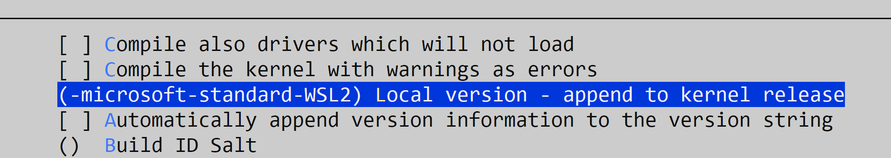
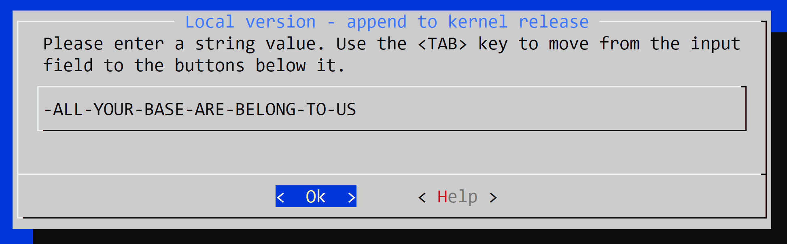

# wsl2-linux-kernel

Default kernel supplied with WSL is somewhat limited, for example loading kernel modules is not supported.

In order to rebuild the kernel follow steps below.

***NOTE***: files provided in this repository are only examples for scripts, configurations and sources for implementing the instructions below. Their usage is not required. It is **very recommended** to follow the instructions here and perform each step manually.


## Kernel Version

WSL kernel versions can be obtained from:
> https://github.com/microsoft/WSL2-Linux-Kernel/releases
> 
These instructions were tested with version: linux-msft-wsl-5.15.146.1.tar.gz

## Retrieve sources
Download sources
```
wget https://github.com/microsoft/WSL2-Linux-Kernel/archive/refs/tags/linux-msft-wsl-5.15.146.1.tar.gz
```
Extract archive using *tar* command
* *x* = extract
* *v* = verbose
* *f* = file
```
tar -xvf linux-msft-wsl-5.15.146.1.tar.gz
```
Change into directory
```
cd WSL2-Linux-Kernel-linux-msft-wsl-5.15.146.1
```

## Build

Run *make* command
* *KCONFIG_CONFIG* chooses wsl-specific settings
* *-j* = number of concurrent jobs
* *\`nproc\`* = returns number of processor cores for optimal build time, for example substitutes it with *8*
```
make KCONFIG_CONFIG=Microsoft/config-wsl -j`nproc`
```

Output image will be located in:
> arch/x86/boot/bzImage


## Install

1. In Windows user directory: add file .wslconfig
2. Copy bzImage output to the same user directory
2. Insert path to bzImage in .wslconfig (**make sure to keep double slashes and not have extra spaces!**)
	```
	[wsl2]
	kernel=C:\\Users\\Dima\\bzimage
	```
3. To close all wsl instances, run in **Windows** cmd:
	```
	wsl --shutdown
	```
4. Run wsl


Full instructions can be found here:
> https://learn.microsoft.com/en-us/windows/wsl/wsl-config#wslconfig


## More Advanced Topics

### Kernel Configuration

Kernel can be configured as needed to add or remove features.

To open kernel configuration menu, perform in kernel source directory:
```
make KCONFIG_CONFIG=Microsoft/config-wsl menuconfig
```
Navigate through menu and make custom selections, then save config and exit. Afterward perform **Build** and **Install** according to instructions above.

#### Example: Set Custom Version Name

In menu, navigate to:
> General setup --> Local version - append to kernel release


Enter custom string:



Save configuration and exit

Build and install the kernel

Verify version using:
```
uname -a
```


### Kernel Module Build

Kernel module can be used to add a specific feature into the kernel, for example: implement a device driver.

In WSL case, to build a kenel module execute the following in source code directory:
```
make -C path/to/WSL2-Linux-Kernel-linux-msft-wsl-5.15.146.1 M=$(pwd) modules
```

